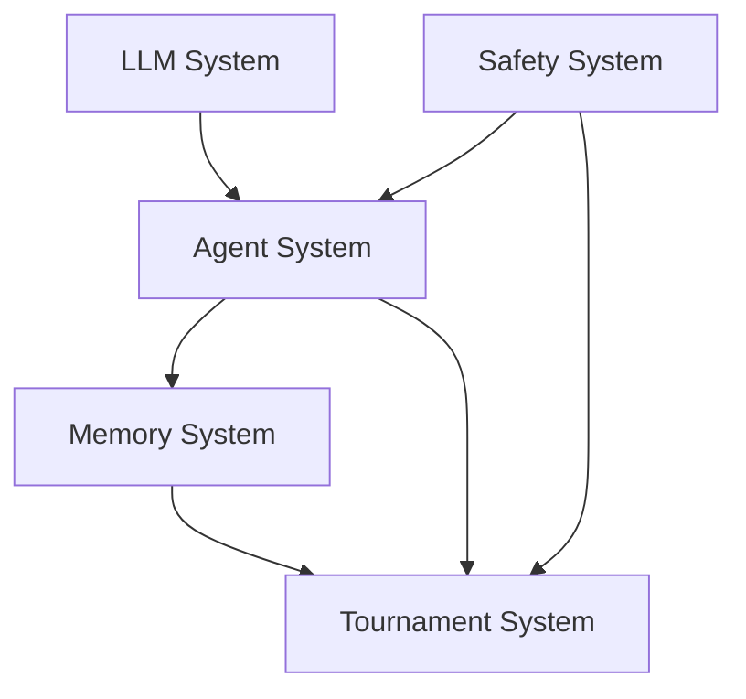
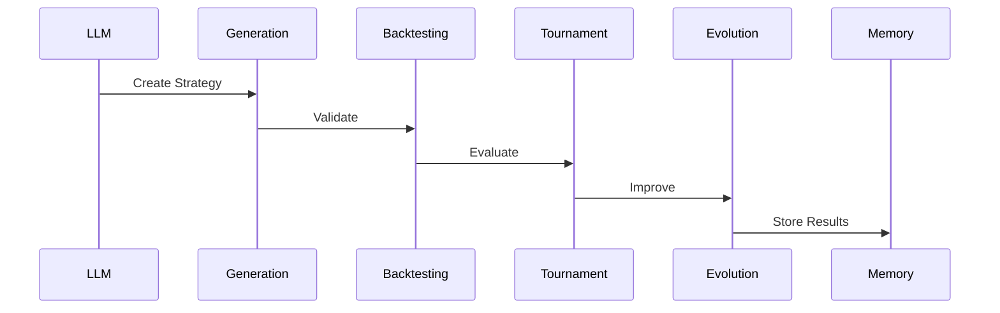
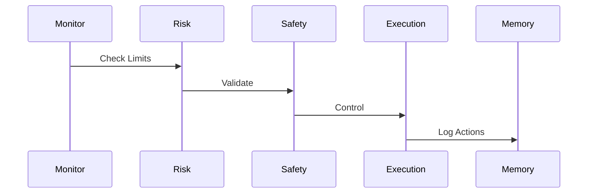

# System Architecture Documentation

## Overview

This directory contains comprehensive architectural documentation for the Enhanced Trading Strategy System, detailing the design and implementation of all major components.

## Core Components

### [LLM System](llm_system.md)
- Core LLM integration
- Model Context Protocol
- Agent framework
- Tool integration
- Safety mechanisms

### [Agent Interactions](agent_interactions.md)
- Communication protocols
- Message formats
- Interaction patterns
- State management
- Error handling

### [Memory System](memory_system.md)
- Memory types and structure
- Storage architecture
- Context management
- Learning integration
- Performance optimization

### [Tournament System](tournament_system.md)
- Elo rating implementation
- Strategy evolution
- Performance evaluation
- Selection process
- Optimization methods

### [Safety and Ethics](safety_ethics.md)
- Trading controls
- Risk management
- Compliance framework
- Monitoring systems
- Incident response

## Implementation

### [Implementation Timeline](implementation_timeline.md)
- Phase breakdown
- Resource allocation
- Milestones
- Dependencies
- Risk management

## System Design Principles

### 1. Modularity
- Independent components
- Clear interfaces
- Pluggable architecture
- Extensible design

### 2. Safety
- Risk controls
- Market impact limits
- Position management
- Error handling

### 3. Performance
- Efficient processing
- Resource optimization
- Scalable design
- Caching strategies

### 4. Reliability
- Fault tolerance
- Error recovery
- Data consistency
- System stability

## Component Dependencies



## System Workflows

### 1. Strategy Development


### 2. Risk Management


## Integration Points

### External Systems
- Market data providers
- Trading platforms
- Risk management systems
- Compliance systems

### Internal Systems
- Data pipeline
- Model training
- Strategy evaluation
- Performance monitoring

## Development Guidelines

### 1. Code Organization
```
src/
├── core/           # Core system components
├── agents/         # Specialized agents
├── strategies/     # Trading strategies
└── utils/         # Utility functions
```

### 2. Testing Requirements
- Unit tests
- Integration tests
- System tests
- Performance tests

### 3. Documentation Standards
- Code documentation
- API documentation
- Architecture updates
- Change tracking

## Deployment Architecture

### Components
- LLM services
- Agent processes
- Memory stores
- Monitoring systems

### Infrastructure
- Compute resources
- Storage systems
- Network configuration
- Security measures

## Monitoring and Maintenance

### System Monitoring
- Performance metrics
- Resource usage
- Error rates
- System health

### Maintenance Procedures
- Backup processes
- Update procedures
- Recovery plans
- Performance tuning

## Security Considerations

### Data Security
- Access control
- Encryption
- Audit logging
- Compliance

### System Security
- Authentication
- Authorization
- Monitoring
- Incident response

## Future Considerations

### Planned Enhancements
- Advanced agents
- Improved evolution
- Enhanced safety
- Additional features

### Research Areas
- LLM improvements
- Strategy optimization
- Risk management
- Market analysis

## Supporting Documentation

### Development
- [API Documentation](../api/README.md)
- [Development Guide](../development/README.md)
- [Testing Guide](../testing/README.md)

### Operations
- [Deployment Guide](../deployment/README.md)
- [Operations Manual](../operations/README.md)
- [Troubleshooting Guide](../troubleshooting/README.md)

### User Documentation
- [User Guide](../user/README.md)
- [Configuration Guide](../config/README.md)
- [Tutorial Guide](../tutorials/README.md)