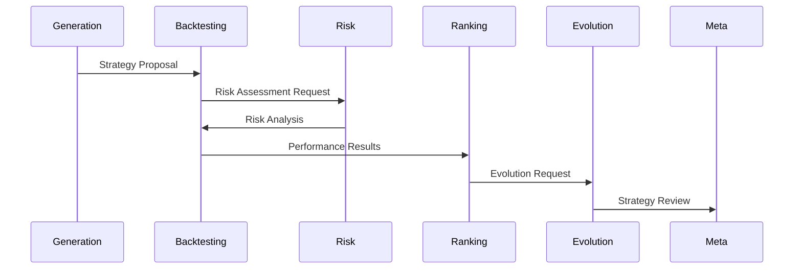

# Agent Interaction System

## Overview

This document details the interaction and communication protocols between specialized agents in the Enhanced Trading Strategy System.

## Agent Communication Protocol

### 1. Message Structure

```yaml
message:
  header:
    source_agent: "generation_agent"
    target_agent: "backtesting_agent"
    timestamp: "2025-02-03T12:00:00Z"
    message_id: "uuid"
    priority: "normal"
    
  content:
    type: "strategy_proposal"
    payload: {}
    context: {}
    
  metadata:
    version: "1.0"
    requires_response: true
    timeout: 300
```

### 2. Message Types

#### Strategy Development
```yaml
strategy_proposal:
  description: "New strategy hypothesis"
  parameters:
    - entry_conditions
    - exit_conditions
    - position_sizing
    - risk_parameters

strategy_evaluation:
  description: "Strategy assessment results"
  metrics:
    - performance_metrics
    - risk_metrics
    - stability_metrics
```

#### Risk Assessment
```yaml
risk_analysis:
  description: "Risk evaluation request/response"
  components:
    - volatility_assessment
    - exposure_analysis
    - correlation_study
    - drawdown_analysis
```

#### System Control
```yaml
control_message:
  description: "System control commands"
  types:
    - pause_trading
    - resume_trading
    - emergency_stop
    - status_request
```

## Agent Interaction Patterns

### 1. Strategy Development Flow



### 2. Decision Making Process

#### Strategy Validation
1. Generation Agent proposes strategy
2. Backtesting Agent simulates performance
3. Risk Agent assesses risk profile
4. Ranking Agent evaluates relative performance
5. Evolution Agent suggests improvements
6. Meta-Review Agent provides oversight

#### Consensus Building
```yaml
consensus:
  required_approvals: 3
  voting_weights:
    risk_agent: 2.0
    backtesting_agent: 1.5
    meta_review_agent: 1.5
    others: 1.0
```

### 3. Coordination Mechanisms

#### Event System
```yaml
events:
  market_update:
    priority: high
    broadcast: true
    handlers: all_agents
    
  strategy_update:
    priority: normal
    target: interested_agents
    requires_ack: true
    
  system_alert:
    priority: critical
    broadcast: true
    requires_response: true
```

#### State Management
```yaml
state_tracking:
  shared_state:
    market_conditions: read_all
    active_strategies: read_all
    system_status: read_all
    
  private_state:
    agent_specific: write_own
    calculations: write_own
    temporary_data: write_own
```

## Safety and Control

### 1. Error Handling

#### Communication Errors
```yaml
error_handling:
  retry_policy:
    max_attempts: 3
    backoff: exponential
    timeout: 30s
    
  fallback:
    type: graceful_degradation
    notification: true
    logging: detailed
```

#### State Inconsistency
```yaml
state_recovery:
  detection:
    frequency: continuous
    checks: [consistency, completeness]
    
  resolution:
    strategy: consensus_based
    voting_required: true
    logging: audit_level
```

### 2. Rate Limiting

```yaml
rate_limits:
  message_rate:
    max_per_second: 100
    burst_allowance: 200
    
  processing_limits:
    cpu_max: 80%
    memory_max: 80%
    queue_size: 1000
```

## Performance Optimization

### 1. Message Optimization

#### Batching
```yaml
batching:
  enabled: true
  max_size: 100
  max_delay: 50ms
  priority_override: true
```

#### Compression
```yaml
compression:
  enabled: true
  algorithm: "lz4"
  threshold: 1024
  exclude: ["critical", "emergency"]
```

### 2. Processing Optimization

#### Priority Queues
```yaml
queues:
  critical:
    capacity: 100
    workers: 4
    timeout: 1s
    
  normal:
    capacity: 1000
    workers: 2
    timeout: 5s
```

## Monitoring and Debugging

### 1. Interaction Monitoring

#### Metrics Collection
```yaml
metrics:
  communication:
    latency: true
    throughput: true
    error_rate: true
    queue_size: true
    
  processing:
    duration: true
    resource_usage: true
    success_rate: true
```

#### Logging
```yaml
logging:
  levels:
    interaction: debug
    decision: info
    error: error
    security: warn
```

### 2. Debugging Tools

#### Trace System
```yaml
tracing:
  enabled: true
  sampling_rate: 0.1
  retention: 7d
  details: full
```

#### Visualization
```yaml
visualization:
  interaction_graph: true
  message_flow: true
  state_changes: true
  performance_metrics: true
```

## Integration Points

### 1. External Systems

#### Market Data Integration
```yaml
market_data:
  real_time: true
  historical: true
  indicators: true
  broadcast: all_agents
```

#### Trading System Integration
```yaml
trading:
  execution: controlled
  validation: required
  monitoring: continuous
  feedback: real_time
```

### 2. Tool Integration

#### Analysis Tools
```yaml
analysis:
  technical: available
  fundamental: available
  risk: required
  performance: required
```

#### Support Systems
```yaml
support:
  monitoring: active
  logging: detailed
  alerting: enabled
  reporting: automated
```

## Documentation and Training

### 1. Interaction Patterns

- Standard workflows
- Error handling
- Performance optimization
- Security measures

### 2. Best Practices

- Message design
- State management
- Error handling
- Performance tuning
- Security considerations