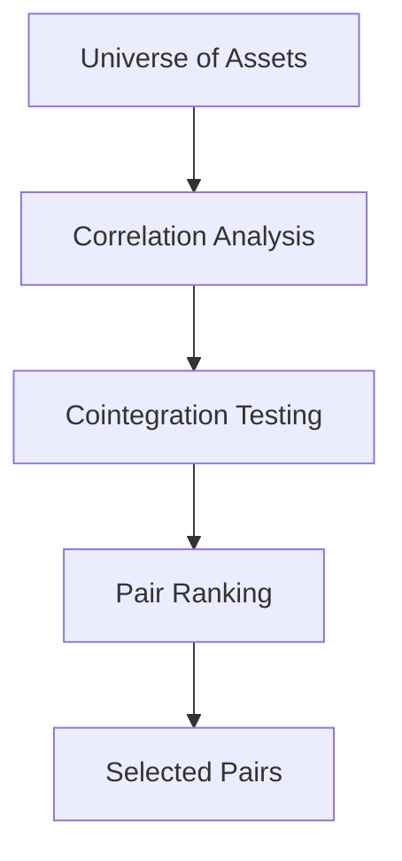

# Statistical Arbitrage Strategy Design

## Overview

This document outlines the design for implementing market-neutral statistical arbitrage capabilities in the trading system. The implementation will provide automated pair selection, spread analysis, and market-neutral position management.

## Core Components

### 1. Pair Selection Module



- **Correlation Filter**
  - Calculate rolling correlations between assets
  - Filter pairs with high correlation (e.g. > 0.7)
  - Consider sector/industry relationships

- **Cointegration Testing**
  - Implement Engle-Granger test for cointegration
  - Calculate optimal hedge ratios
  - Track cointegration stability over time

- **Pair Ranking**
  - Score pairs based on:
    - Correlation strength
    - Cointegration significance
    - Historical spread behavior
    - Liquidity considerations

### 2. Spread Analysis

- **Spread Calculation**
  - Implement hedge ratio-weighted price difference
  - Normalize spreads using z-scores
  - Track spread mean reversion characteristics

- **Signal Generation**
  - Entry signals when spread exceeds thresholds (e.g. ±2 std dev)
  - Exit signals on mean reversion or stop loss
  - Consider spread momentum and velocity

### 3. Market Neutrality

- **Position Sizing**
  - Maintain dollar neutrality between pair positions
  - Implement beta-neutral positioning using `BenchmarkPerformanceAnalyzer`
  - Consider sector/industry neutrality

- **Risk Management**
  - Position limits per pair
  - Portfolio-level exposure limits
  - Correlation breakdown monitoring
  - Stop loss and take profit rules

### 4. Performance Analysis

Integration with existing `BenchmarkPerformanceAnalyzer` class to add:

- Pair-specific metrics
  - Spread mean reversion statistics
  - Win rate per pair
  - Average profit per trade
  - Sharpe ratio per pair

- Portfolio-level metrics
  - Market neutrality verification
  - Beta exposure over time
  - Sector exposure analysis
  - Attribution analysis

## Implementation Plan

1. Create `StatisticalArbitrageStrategy` class
```python
class StatisticalArbitrageStrategy:
    def __init__(self):
        self.pairs = []              # Selected pairs
        self.spreads = {}            # Current spreads
        self.positions = {}          # Current positions
        self.hedge_ratios = {}       # Hedge ratios
```

2. Implement pair selection
```python
def select_pairs(self, universe):
    """
    Select tradeable pairs using correlation and cointegration
    
    Args:
        universe: List of tradeable assets
        
    Returns:
        List of selected pairs with metadata
    """
```

3. Add spread analysis
```python
def analyze_spreads(self):
    """
    Calculate and analyze spreads for all pairs
    
    Returns:
        Dict of spread analytics per pair
    """
```

4. Position management
```python
def calculate_positions(self):
    """
    Calculate position sizes maintaining market neutrality
    
    Returns:
        Dict of target positions
    """
```

## Integration Points

1. Benchmark Performance
- Extend `BenchmarkPerformanceAnalyzer` for pair analytics
- Add statistical arbitrage-specific metrics
- Enhance visualization capabilities

2. Risk Management
- Add pair-specific risk monitoring
- Implement correlation breakdown detection
- Track market neutrality metrics

3. Reporting
- Create pair performance dashboard
- Add spread visualization tools
- Include market neutrality analysis

## Testing Strategy

1. Unit Tests
- Pair selection logic
- Spread calculations
- Position sizing
- Risk checks

2. Integration Tests
- End-to-end strategy execution
- Market neutrality verification
- Performance analysis

3. Backtesting
- Historical pair behavior
- Strategy performance metrics
- Risk management effectiveness

## Next Steps

1. Switch to Code mode to implement `StatisticalArbitrageStrategy`
2. Create test suite with sample data
3. Integrate with existing backtesting framework
4. Add reporting and visualization components